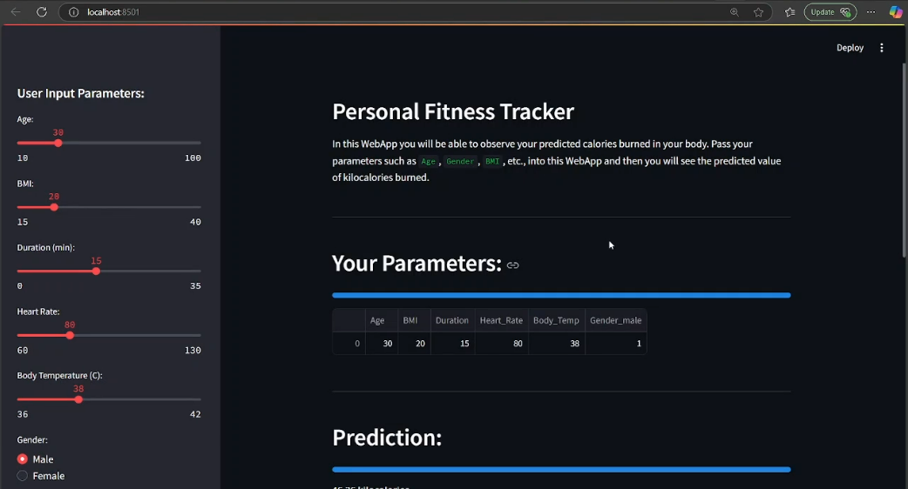

# Self Health Tracker


## Description
The Self Health Tracker is a web application built using Streamlit that allows users to input various health-related metrics and provides predictions on kilocalories burned along with exercise recommendations. The application utilizes machine learning models to analyze user data and offer personalized insights.

## Features
- User input fields for age, weight, height, BMI, body temperature, heart rate, gender, BMI duration, and activity level.
- Predicts kilocalories burned based on user input.
- Provides exercise recommendations based on the prediction.
- Displays entered data and prediction results.

## Installation
To set up the project, follow these steps:
1. Clone the repository:
   ```
   git clone <repository-url>
   ```
2. Navigate to the project directory:
   ```
   cd self_health_tracker
   ```
3. Install the required dependencies:
   ```
   pip install -r requirements.txt
   ```

## Usage
To run the application, execute the following command:
```
streamlit run app.py
```
Open your web browser and navigate to `http://localhost:8501` to access the application.

## Dependencies
- streamlit
- pandas
- scikit-learn

## Contributing
Contributions are welcome! Please submit a pull request or open an issue for any suggestions or improvements.

## License
This project is licensed under the MIT License. See the LICENSE file for more details.
